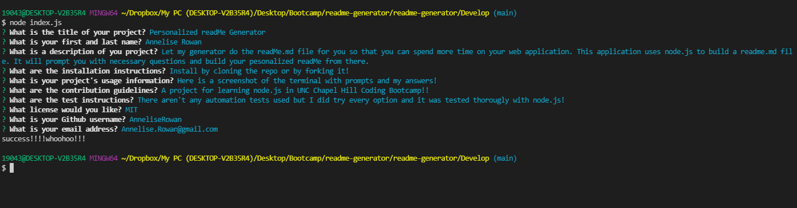

# Personalized readMe Generator

## Owned By

Annelise Rowan 

## Description

Let my generator do the readMe.md file for you so that you can spend more time on your web application. This application uses node.js to generate a readme.md file. It will prompt you in the command line with necessary questions and build your pesonalized readMe from there. 

## Example

## Issues

Please do not hesitate to open a PR if there are any bugs or issues you come across! :D
